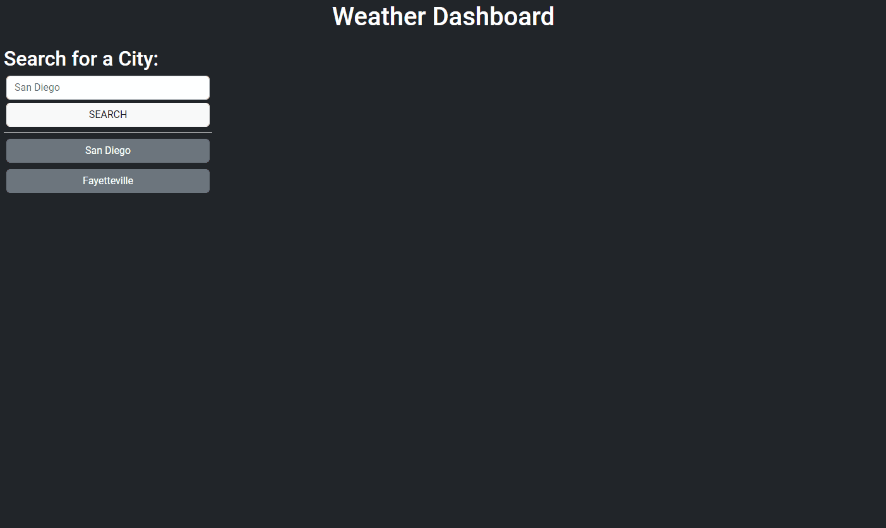

# Weather Dashboard

## Table of Contents
- [Description](#description)
- [Files](#files)
- [Requirements](#requirements)
- [Installation](#installation)
- [Usage](#usage)
- [Live Demo](#live-demo)
- [Preview](#preview)

## Description
The Weather Dashboard is a web application that allows users to search for weather information for a specific city. It provides real-time weather data, including current weather conditions and a five-day forecast. Users can also view their search history and access previously searched cities easily.

## Files
- `index.html`: Main HTML file for the weather dashboard interface.
- `style.css`: CSS file for styling the weather dashboard.
- `script.js`: JavaScript file containing the application logic.

## Requirements
- Web browser with JavaScript enabled.

## Installation
1. Clone the repository to your local machine:

   ```bash
   git clone https://github.com/jordanchives/weather-dashboard.git

2. Navigate to the project directory.

## Usage
1. Open index.html in a web browser.
2. Enter the name of the city you want to check the weather for in the search input field.
3. Click on the "SEARCH" button or press Enter to fetch weather information.
4. View the current weather conditions and five-day forecast for the specified city.
5. Access previously searched cities from the search history section.

## Live Demo
The live demo of the Weather Dashboard can be accessed [here](https://jordanchives.github.io/weather-dashboard/).

## Preview


---

Application is developed by Jordan.

[](LICENSE)